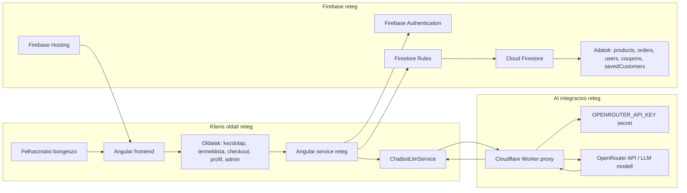

# Komponens-architektura abra: Angular, Firebase es OpenRouter

## Beillesztheto abra

A Word dokumentumba kozvetlenul beillesztheto SVG fajl:

- `docs/02_architecture/diagram_kepek/09_komponens_architektura_firebase_worker_openrouter.svg`

Javasolt abracim:

**A TDLWebshop komponens-architekturaja Firebase es OpenRouter integracioval**

Javasolt hely a dolgozatban:

**Tervezes / Architektura** vagy **Megvalositas / Rendszerintegraciok**

## Szakdolgozatba illesztheto magyarazo szoveg

Az abra a TDLWebshop magas szintu komponens-architekturajat mutatja be. A felhasznalo a bongeszoben futtathato Angular alkalmazason keresztul eri el a vasarloi es admin funkciokat. A frontend Firebase Hostingon keresztul kerul kiszolgalasra, az azonositasert a Firebase Authentication felel, az alkalmazas fo adatai pedig a Cloud Firestore adatbazisban talalhatok. A Firestore elerese nem kozvetlenul szabad, hanem a Firestore Rules szabalyretegen keresztul tortenik, amely ellenorzi a felhasznalo szerepkoret, a tiltott allapotot es a muveletek jogosultsagat.

Az AI asszisztens kulon integracios uton mukodik. A kliensoldali ChatbotLlmService nem tartalmaz OpenRouter API kulcsot, hanem a kerest egy Cloudflare Worker proxyhoz kuldi. A Worker szerveroldalon tarolja a kulcsot, ellenorzi a hivas eredetet, majd tovabbitja a kerest az OpenRouter API fele. Ez a megoldas azert fontos, mert a kulcs nem kerul ki a publikus frontend kodba, mikozben az AI asszisztens kepes a termekkatalogushoz es az epulegepeszeti temakorhoz kotott valaszokat adni.

## Mermaid forras

