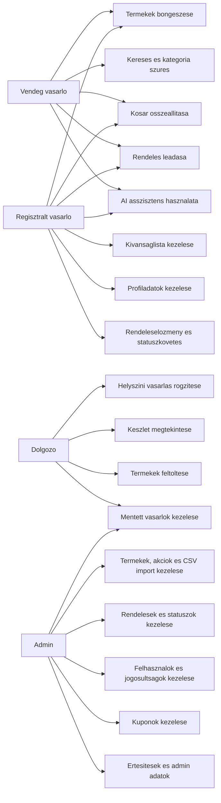
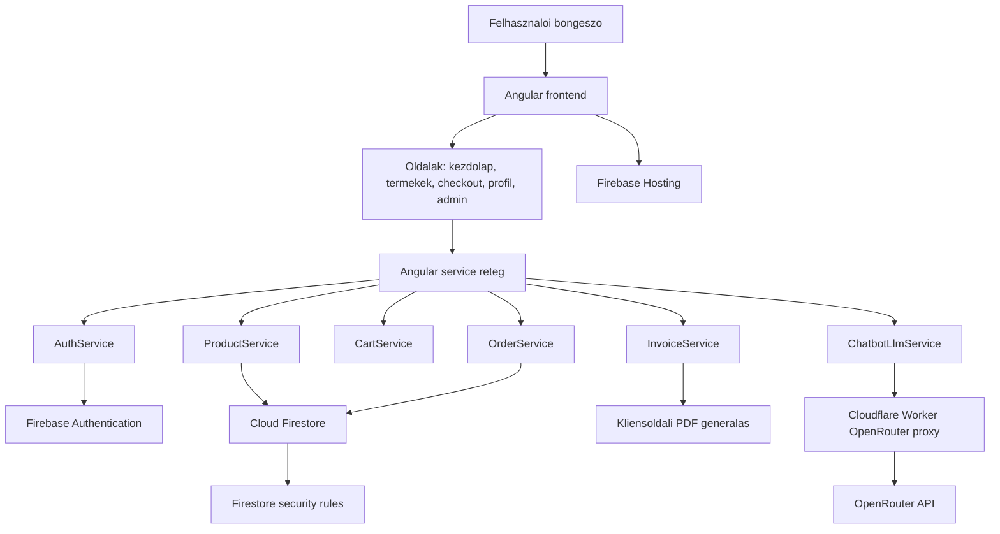
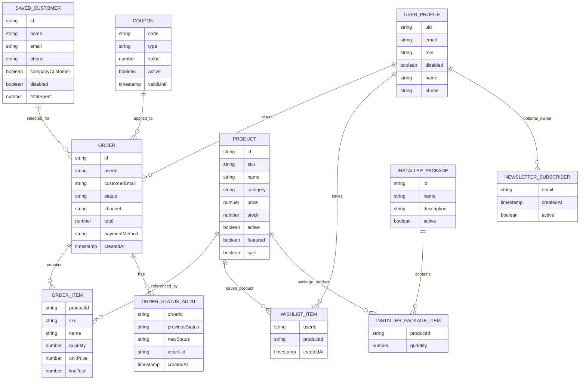
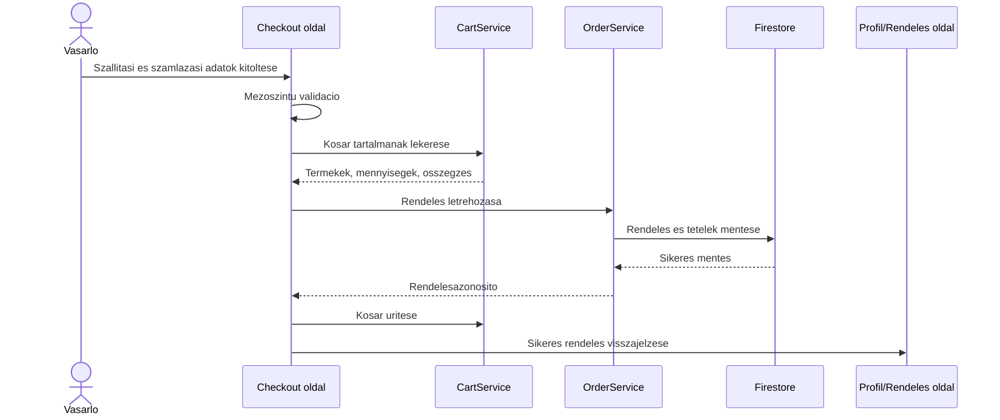
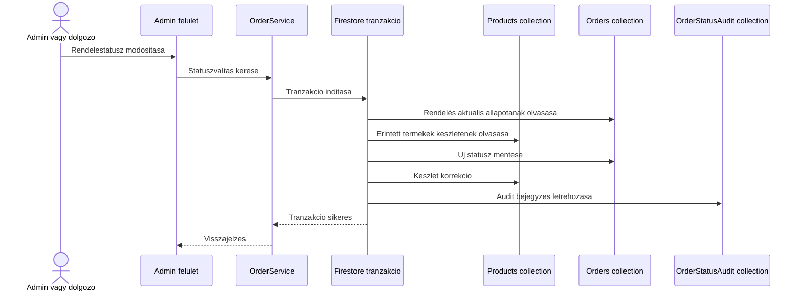
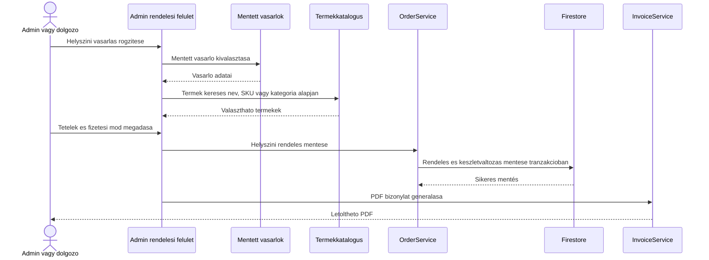
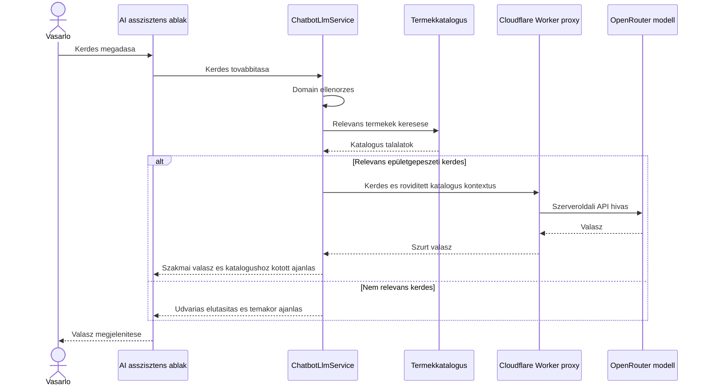
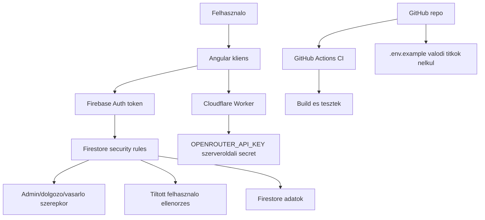

# TDLWebshop szakdolgozati diagramcsomag

Ez a fajl a szakdolgozatba beillesztheto, aktualis diagramokat tartalmazza Mermaid formatumban.
A diagramok GitHubon es sok Markdown editorban automatikusan megjelennek. Wordbe legegyszerubben
PNG/SVG kepkent erdemes beilleszteni oket, majd az alabbi abracimeket hasznalni.

## Kesz kepfajlok

A Wordbe kozvetlenul beszurhato SVG kepek itt vannak:

- [01_use_case_attekintes.svg](diagram_kepek/01_use_case_attekintes.svg)
- [02_komponens_architektura.svg](diagram_kepek/02_komponens_architektura.svg)
- [03_adatmodell.svg](diagram_kepek/03_adatmodell.svg)
- [04_checkout_folyamat.svg](diagram_kepek/04_checkout_folyamat.svg)
- [05_admin_statusz_keszlet.svg](diagram_kepek/05_admin_statusz_keszlet.svg)
- [06_helyszini_vasarlas.svg](diagram_kepek/06_helyszini_vasarlas.svg)
- [07_ai_asszisztens.svg](diagram_kepek/07_ai_asszisztens.svg)
- [08_biztonsagi_attekintes.svg](diagram_kepek/08_biztonsagi_attekintes.svg)

## Beillesztesi javaslat

| Abra | Hova keruljon a dolgozatban | Javasolt abracim |
| --- | --- | --- |
| 1. Use case attekintes | Kovetelmenyek / Funkcionalis specifikacio | A TDLWebshop fo felhasznaloi szerepkorei es funkcioi |
| 2. Komponens architektura | Tervezes / Architektura | A TDLWebshop magas szintu komponens-architekturaja |
| 3. Adatmodell | Tervezes / Adatmodell | A rendszer fo adatentitasai es kapcsolatai |
| 4. Checkout szekvencia | Megvalositas / Vasarloi folyamatok | A rendelesleadas folyamata |
| 5. Admin statuszvaltas es keszletkezeles | Megvalositas / Admin folyamatok | Rendelestatusz valtas es keszletmodositas tranzakcioban |
| 6. Helyszini vasarlas | Megvalositas / Admin vagy dolgozoi folyamatok | Helyszini vasarlas rogzitese mentett vasarloval |
| 7. AI asszisztens | Megvalositas / AI asszisztens | A katalogushoz kotott AI asszisztens mukodesi folyamata |
| 8. Biztonsagi attekintes | Biztonsag / Jogosultsagkezeles | Hitelesites, jogosultsagok es titokkezeles attekintese |

## 1. Use case attekintes

## 2. Komponens architektura

## 3. Adatmodell

## 4. Checkout szekvencia

## 5. Admin statuszvaltas es keszletkezeles

## 6. Helyszini vasarlas

## 7. AI asszisztens folyamata

## 8. Biztonsagi attekintes

## Exportalas Wordhoz

1. Nyisd meg ezt a fajlt GitHubon vagy Markdown/Mermaid elonezetben.
2. Minden diagramot kulon exportalj vagy kepernyokepezz PNG/SVG formatumban.
3. Wordben a megfelelo fejezetbe illeszd be kepkent.
4. Az abracimeket a fenti tablazatbol hasznald, majd a sajat dolgozati stilusodhoz igazitsd.

Ha a dolgozatban pontosabb hivatkozast szeretnel, a fenti diagramokra lehet igy utalni:
"A rendszer fo szerepkoreit es funkcioit az X. abra mutatja be.", illetve
"Az adatmodell fo entitasait es kapcsolatait az Y. abra foglalja ossze."
