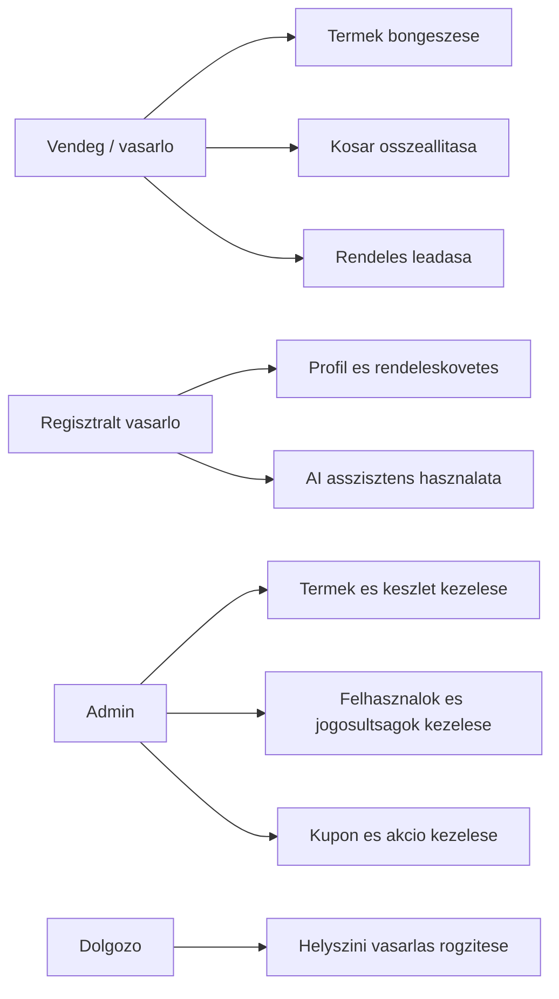
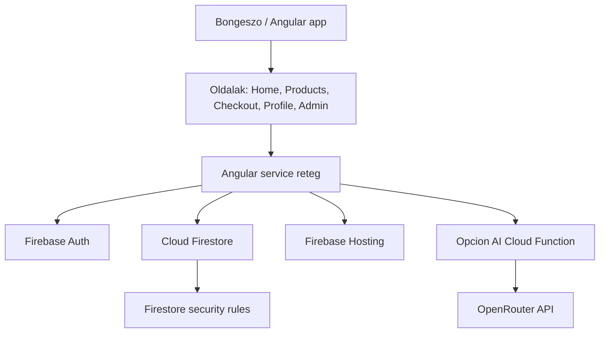
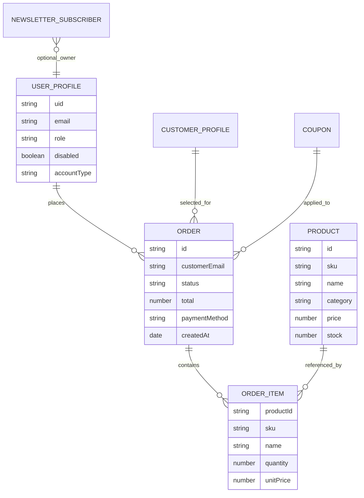
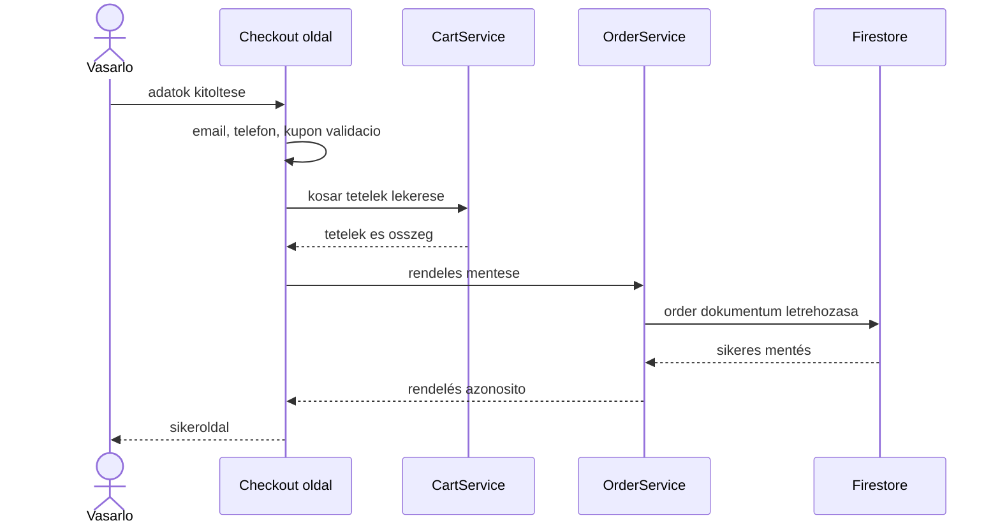
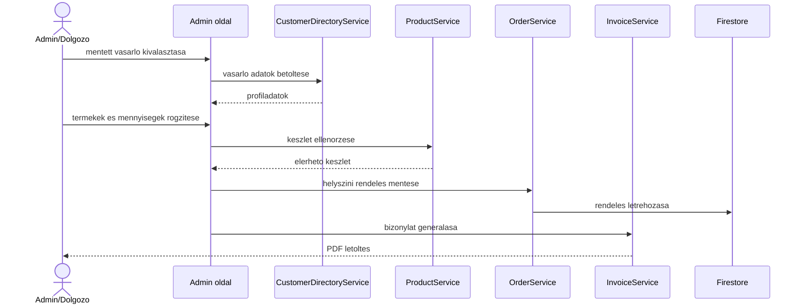

# Szakdolgozati abrak Mermaid formaban

Ezek az abrak a konzulensi mintacsomag abra-javaslataihoz igazodnak. A dolgozatba kepkent is beilleszthetok, vagy Mermaid-kent forrasban tarthatok.

## Use case attekintes

## Komponens architektura

## Adatmodell roviditett nezete

## Checkout szekvencia

## Helyszini vasarlas szekvencia

